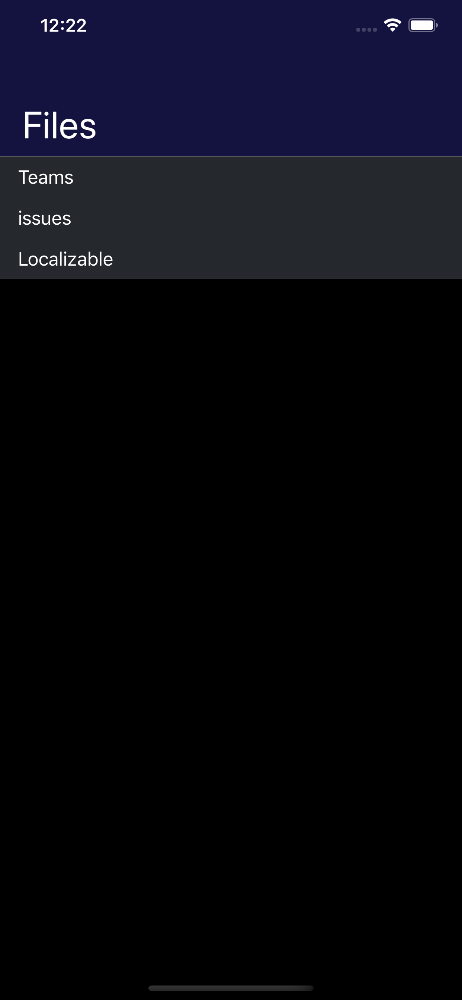
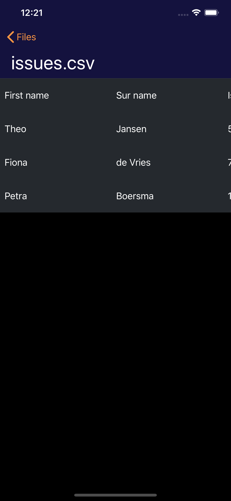
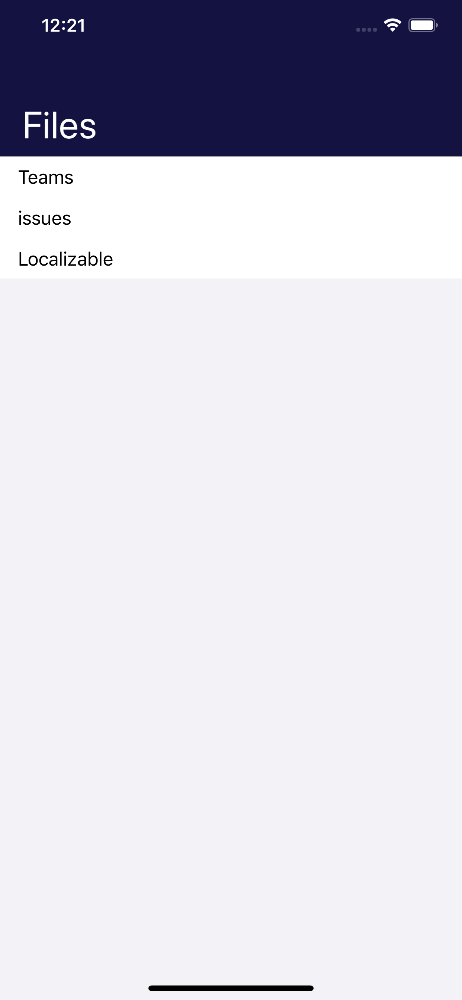
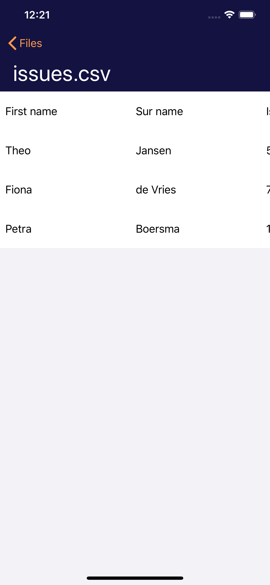

# CSVReader

**Your best ally against CSVs**

 

---------

## Installation

- The project is splitted in two folders:
  - **CSVReader:** Contains the iOS Application related files.
  - **Packages:** Contains the two local packages from which the application depends on. For more details about these packages, please check their respective README files.
- Run`bundle install` to install the dependencies.
- Open `CSVReader.xcodeproj`
- Build
- Run

## Usage

The application is prepared to load the CSV files that are included within its bundle. For that matter, if you wish to use another CSV file, all you need to do is add it to `CSVReader` target.

To keep things clean, the CSV files that are already bundled within this project are located under: `CSVReader/Resources/CSV`

> **Note:** The Localizable.csv file is under the Localization folder but is also displayed in the list of prebundled files for testing purposes.

------

## Features

- ✅ Find CSV files bundled with the app.
- ✅ Display content of the selected CSV file.
- ✅ Handle different application states: Loading, Error, Normal.
- ✅ Accessibility support for Dynamic Font Sizing.
- ✅ Beautiful UI in both Light and Dark mode.
- ✅ Localized into three languages: English(default), Spanish, Dutch.

## Roadmap

- ❒ Add UI support for distinct delimiters.
- ❒ Add support to map the structure of the CSV if any.
- ❒ Add support to custommize the UI based on the content. (Ex, Highlight the header...)
- ❒ Allow the user to pick CSV files from other locations. (Ex. Files App)

## Personal Goals

I took this opportunity to experiment with new tools and frameworks.

- ✅ Get a basic understanding of Combine.
- ✅ Get a basic understanding of SwiftUI.
- ✅ Make use of SPM for external and local dependencies.
- ✅ Colors catalogue for Light and Dark Mode.
- ⚠️ Apply dependency injection by making use of property wrappers.

------

## Project Architecture

## Dependencies

### Localization

This project uses [Babelish](https://github.com/netbe/Babelish) to handle the generation of the localization files based on a csv file that serves as source of truth.

This file can be found at: `CSVReader/Resources/Localization`

### CSVImporter

To load and parse the content of the CSV files, this project leverages on the [CSVImporter](https://github.com/Flinesoft/CSVImporter#installation) library.

> To know the reason behind this decision, please check the Assumptions section.

## Project Structure

- **Packages**: Contains the local SPM packages. CSVReaderCore & CommonUI. For more details about these packages, please be sure to check their respective README files.
- **CSVReader:** Contains all the files related to the iOS Application.
  - **Common:** Contains the files that are not specific to any section of the app.
    - **Contracts:** Contains the protocols for the different components of MVVM. Due to the simplicity of the project, currently it only has the `ViewProtocol` & `ViewModelProtocol`
    - **UI:** Contains the files related to UI customization, theming and reusable views.
  - **App:** Contains the AppDelegate and the LaunchScreen. In case this project needed to support multiple scenes. The SceneDelegate would also fall under this folder.
  - **Screens:** Contains the files for each screen available in the application. Each under its own folder.
    - The structure of these folders, depending on their respective needs, could be as follows:
      - Model
      - Design Guidelines
      - Components
      - View/ViewController/ViewModel/Builder
    - **Supporting Files:** Contains the configuration files of the project.
    - **Resources:** Contains the files for multiple purposes. Localization, Dummy CSV Files and the Assets catalogue.
  - **CSVReaderTests:** Contains the files corresponding to the tests of the different sections of the app.

## Architecture

The project was build using the **MVVM** UI design pattern. The reason for it was that for the size of this project, this pattern maintains the project structure simple enough and wihtout much boilerplate while still providing all the benefits of any other clean architecture. The main focus being on reusability & testability.

## Navigation

For the current project, and with the intention of keeping things simple enough, an advance navigation pattern was not use. Instead the navigation between screens is handled within the view itself.

In the case when we are navigating from the `FileSelectionView` to the `ContentDisplayView`. The `FileSelectionViewModel` has a dependency on `ContentDisplayBuilder` to be able to provide the view with the root view of the target section.

It would be a subjective topic to mention which navigation pattern would fit best within the project. More information about the roadmap of the project would be needed to be able to take such decision.

## Dependency Injection

There was an attempt to use a modern style of dependency injection, the result of this implementation can be found under the branch `feature/DI`. Nevertheless, that approach was dropped due to the current limitations of the chosen library.

The `master` branch uses the standard way of injecting dependencies through initializers. For reference of how this is done, please check the `*Builder` classes.

## Unit Tests

The project at its current state only contains a set of tests for the ViewModels.

The tests follow the Given/When/Then format.

Ex. `testLoadData_whenItsAbleToLoadTheContent_emitsDataSourceUpdateEvent`

## UI Tests

The project at its current state doesn't contain any UI Tests.

The plan was to do them by making use of the [KIF Framework](https://github.com/kif-framework/KIF) and following the [Robot Pattern](https://academy.realm.io/posts/kau-jake-wharton-testing-robots/).

**Benefits:**

- **KIF:** The benefits of this framework are several, among which I could highlight:
  - Allows you to perform functional tests on your views instead of integration tests.
  - The framework runs on the UnitTests target, which gives you the possibility to perform white box testing by mocking the dependencies. Something that it's not possible to do with the UITests targets.
  - Because it runs on the UnitTests target, we can skip the navigation to specific parts of the app, and directly load the screen in its required state.
- **Robot Pattern:** The pattern is focused on splitting the `What` from the `How` Meaning that you have 2 entities responsable to run the set of tests. The first one is the `XCTestCase` which knows `What` to test and the second would be the `Robot` that knows how to execute the actions.

## Assumptions

- **Why use a library to read the CSV files?**
  During the initial analysis of the assigment I started thinking of what actually could bring value to it and if I decided to build my own CSV parser, how should I build it so it's robust enough so it doesn't break when using other CSV files.

  Once I started thinking about this, my attention went to two main features:

  - Memory Management: we don't want to have a parser that when opening a big file drains all the memory available in the device.
  - Scalable: The parser should be able to parse CSV files regardles of the formatting. That includes the use of `"` and the different possible delimiters.

  After thinking about this, I realized that probably this went beyond the scope of the assignment and that it was more important to focus on the project structure rather than specific components like this.

  Nevertheless, my concerns were still present, that's why while reaserching for a library, I ran into this one that apart from having the basic feature required to open distinct files it also claimed to take into consideration the memory usage when loading large files.